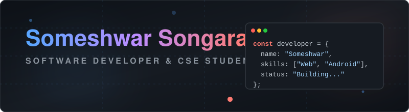

# Someshwar Songara

# Hi there 👋, I'm Someshwar Songara

### B.Tech CSE Student | Web & Android Development | Java, C, C++, Python

  

### 🚀 About Me
I’m a dedicated B.Tech. student in Computer Science and Engineering at MIT Group of Institutes, Ujjain. I have a strong passion for software development, especially in **Web and Android applications**. I continuously develop my technical skills through hands-on projects and practical learning. I am motivated, eager to learn, and actively expanding my experience in software engineering and modern development practices!

- 🌱 **Currently pursuing:** B.Tech CSE (2025 – 2028)
- 🎓 **Previous:** Diploma of Education, Computer Science at Govt. Polytechnic College
- 📫 **How to reach me:** [Connect on LinkedIn](https://www.linkedin.com/in/someshwar-songara/)

---

### 🛠️ Languages and Tools

  
  
  
  
  
  
  
  
  
  

---

### 📊 GitHub Stats & Trophies

  

  

---

### 🐍 My Contribution Graph
Here is an automated snake animation generated from my GitHub contributions!

  <picture>
    <source media="(prefers-color-scheme: dark)" srcset="https://raw.githubusercontent.com/someshwar-songara/someshwar-songara/output/github-contribution-grid-snake-dark.svg">
    <source media="(prefers-color-scheme: light)" srcset="https://raw.githubusercontent.com/someshwar-songara/someshwar-songara/output/github-contribution-grid-snake.svg">
    
  </picture>

